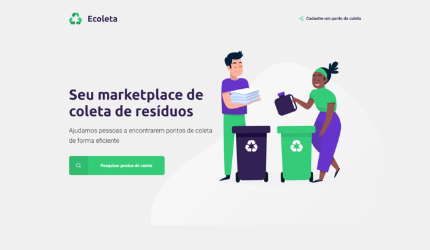
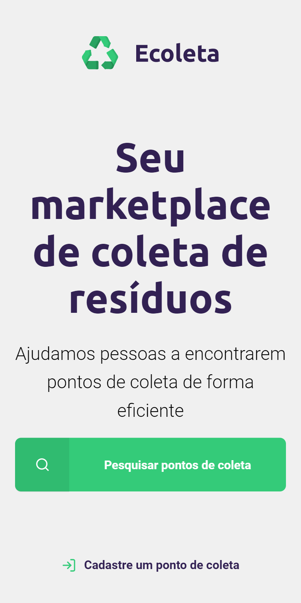
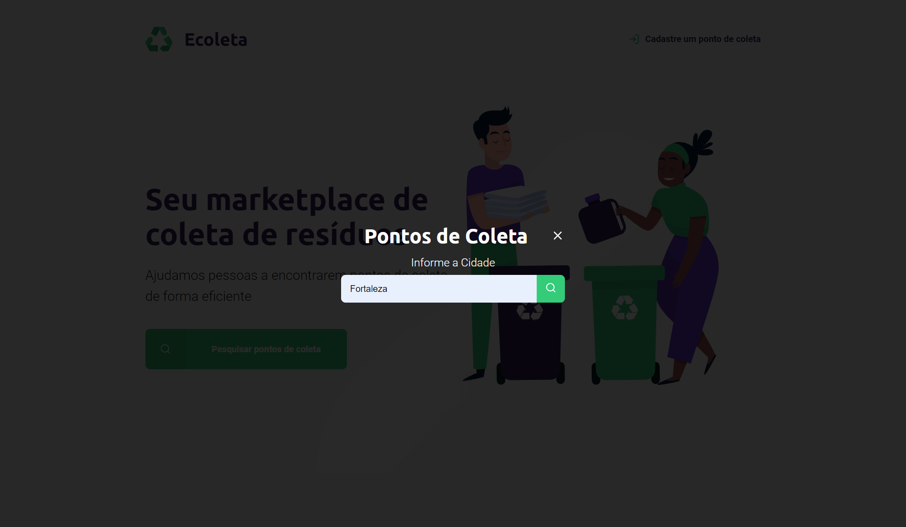
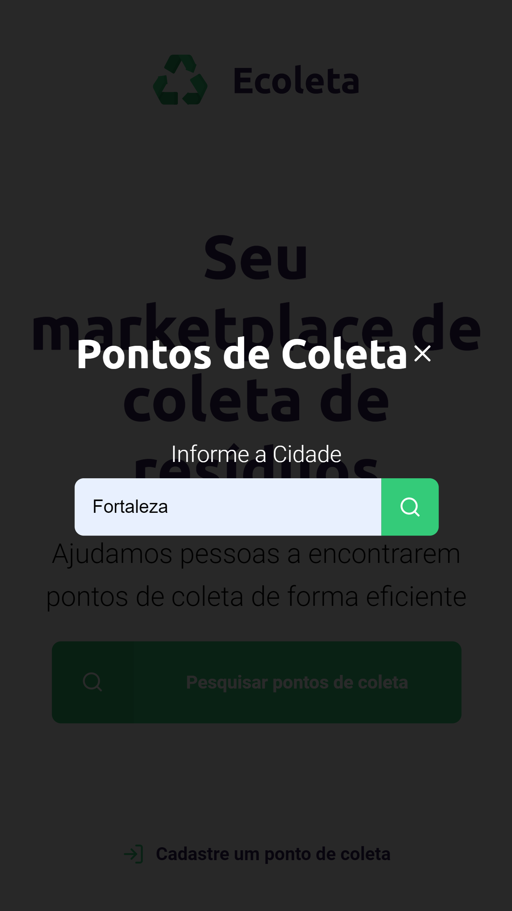
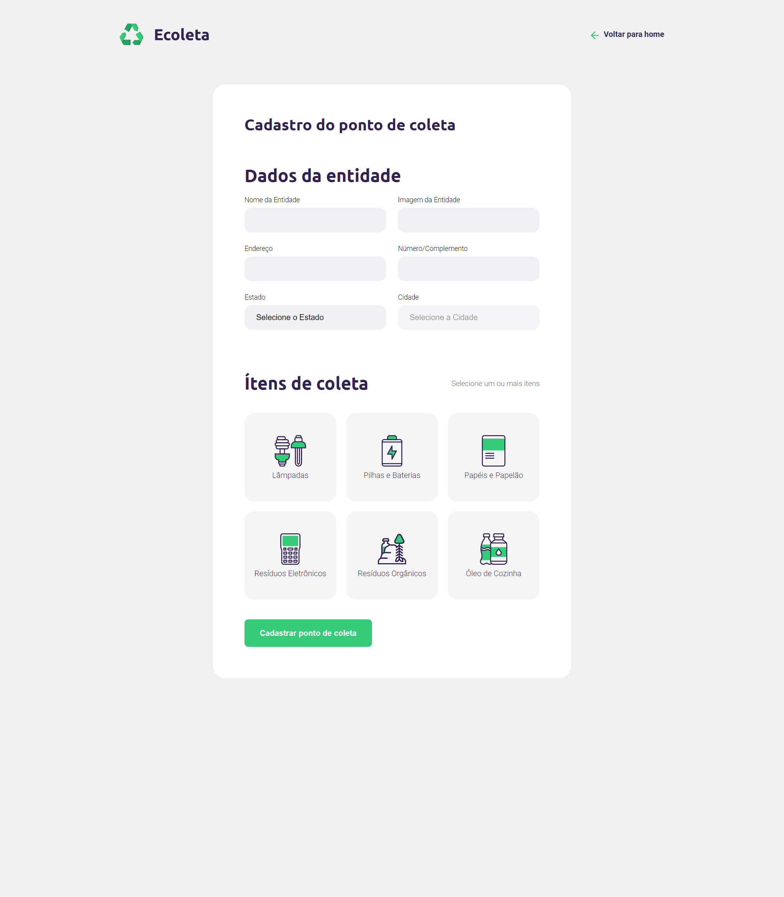
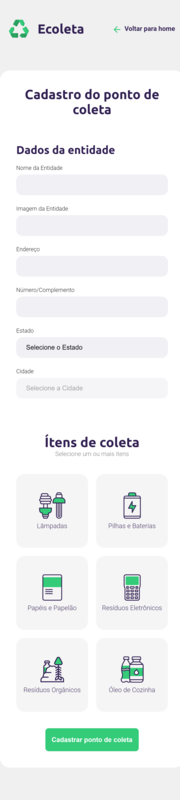
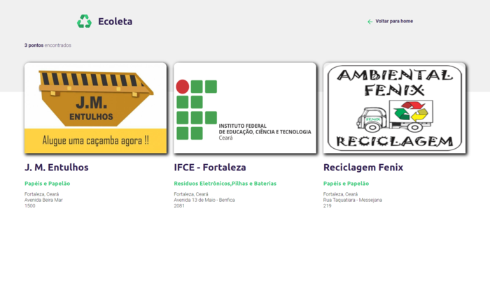
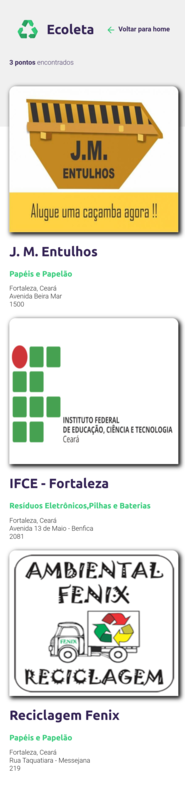

# Projeto Ecoleta
projeto desenvolvido durante a Next Level Week, evento oferecido pela RocketSeat.

A ídeia do projeto é que as empresas/ONG's/Cooperativas que realizem a coleta de materiais recicláveis poderão cadastrar seus pontos de coletas para que os usuários possam realizar as pesquisas dos pontos de coletas por localidades, filtrando os pontos de coletas pelos materiais coletáveis. Desta forma, reduzindo o descarte de materiais recicláveis em locais impróprios.

# App preview

# Thank you
- [RocketSeat](https://github.com/Rocketseat)